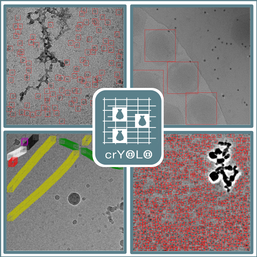

.. crYOLO documentation master file, created by
   sphinx-quickstart on Sat May 16 19:31:49 2020.
   You can adapt this file completely to your liking, but it should at least
   contain the root `toctree` directive.

Welcome to crYOLO's User Guide!
==================================

Welcome, this is the user guide for crYOLO, an application for fast and accurate cryo-EM particle picking.
It's based on convolutional neural networks and utilizes the popular You Only Look Once (YOLO) object detection system.

* crYOLO makes picking **fast** – On a modern GPU it will pick your particles at up to 6 micrographs per second.
* crYOLO makes picking **smart** – The network learns the context of particles (e.g. not to pick particles on carbon or within ice contamination )
* crYOLO makes training **easy** – You might use a general network model and skip training completely. However, if the general model doesn't give you satisfactory results or if you would like to improve them, you might want to train a specialized model specific for your data set by selecting particles (no selection of negative examples necessary) on a small number of micrographs.
* crYOLO makes training **tolerant** – Don't worry if you miss quite a lot particles during creation of your training set. :ref:`crYOLO will still do the job <sparse-picking-label>`.

.. note::

   Please read the :doc:`Complimentary Science Software License <other/license>` before using crYOLO. If you are interested in using crYOLO in a commercial context please contact stefan.raunser@mpi-dortmund.mpg.de

.. figure:: https://s3.amazonaws.com/cdn.f1000.com/images/badges/badgef1000.gif
   :target: https://f1000.com/prime/733517098?bd=1
   :height: 30

User Guide: full table of contents
==================================

.. toctree::
   :maxdepth: 2

   installation
   tutorials/tutorial_overview
   other/other.rst
   changes.rst

.. tools_detailed/tools_in_detail.rst

Part of
=======

Citation
========

**Main paper:**

   Wagner, T., Merino, F., Stabrin, M., Moriya, T., Antoni, C., Apelbaum, A., Hagel, P., Sitsel, O., Raisch, T., Prumbaum, D., Quentin, D., Roderer, D., Tacke, S., Siebolds, B., Schubert, E., Shaikh, T.R., Lill, P., Gatsogiannis, C., Raunser, S., 2019. SPHIRE-crYOLO is a fast and accurate fully automated particle picker for cryo-EM. Commun Biol 2. https://doi.org/10.1038/s42003-019-0437-z

**Filament picking:**

   Wagner, T., Lusnig, L., Pospich, S., Stabrin, M., Schönfeld, F., & Raunser, S. (2020). Two particle picking procedures for filamentous proteins: SPHIRE-crYOLO filament mode and SPHIRE-STRIPER. bioRxiv 2020.02.28.969196. https://doi.org/10.1101/2020.02.28.969196

**Comment:**

   Wagner, T., Raunser, S. The evolution of SPHIRE-crYOLO particle picking and its application in automated cryo-EM processing workflows. Commun Biol 3, 61 (2020). https://doi.org/10.1038/s42003-020-0790-y

Help
====

Any questions? Problems? Suggestions?

Find help at our `mailing list <https://listserv.gwdg.de/mailman/listinfo/sphire>`_!

Indices and tables
==================

* :ref:`search`

.. * :ref:`genindex`
.. * :ref:`modindex`

