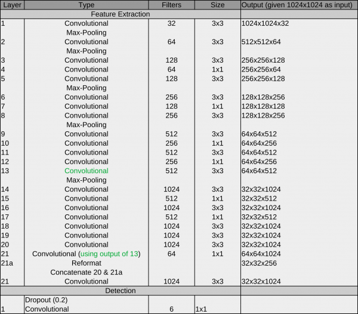
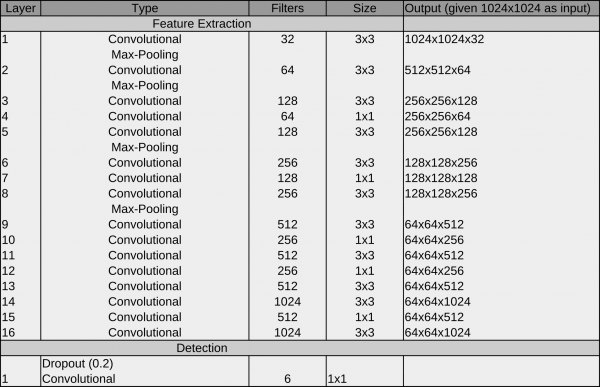
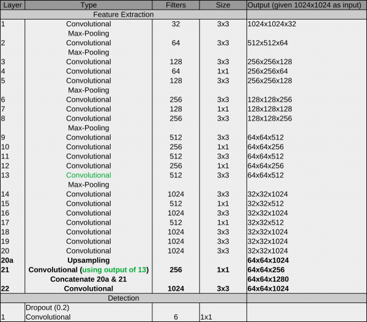

crYOLO networks
^^^^^^^^^^^^^^^

Introduction
*************
The original YOLO architecture looks like this:

The main components are **convolutional operations** and **max pooling operations**:

* Convolutional layer: A convolutional learn local patterns. For 2D images, these are patterns in a small region of the input image. In the YOLO architecture, these are 1×1 or 3×3 windows. The output of a convolutional layer is called feature map.
* Max-pooling operation: Max-pooling operations downsampling the feature maps of previous layers. This enables the following convolutional layers to see a larger extends of the input image.

Another characteristic of this architecture is the passthrough connection between 13 and 21. it helps the network to utilize low level features during detection.

Since crYOLO's inception, several networks were introduced. I will explain them in chronological order.

Network #1 crYOLO
*************

During development, we recognized that the original YOLO network does not work on very small particles. But a subset of the YOLO network (in principle, the first 13 layers) does:

The reason for the better performance on small particles is that the final grid is finer compared to YOLO (64×64 vs 32×32). As it still worked for big particles, we started with the crYOLO network.

**How to use**

The network is still available in crYOLO and you can use it with the config below. However, we recommend using PhosaurusNet for picking single particles.

.. code-block:: JSON

    {
        "model" : {
            "​architecture": ​        "​crYOLO",​
            "​input_size": ​          ​1024,​
            "​anchors": ​             [160,​160],​
            "​max_box_per_image": ​   600
        }

        "train": {
            "train_image_folder":   "train_image/",
            "train_annot_folder":   "train_annotation/",
            "train_times":          10,
            "pretrained_weights":   "model.h5",
            "batch_size":           6,
            "learning_rate":        1e-4,
            "nb_epoch":             50,
            "warmup_epochs":        0,

            "object_scale":         5.0 ,
            "no_object_scale":      1.0,
            "coord_scale":          1.0,
            "class_scale":          1.0,
            "log_path":             "logs/",
            "saved_weights_name":   "model.h5",
            "debug":                true
        },

        "valid": {
            "valid_image_folder":   "",
            "valid_annot_folder":   "",

            "valid_times":          1
        }
    }

Network #2 YOLO with patches
****************************

However, while training the general model with an increasing training dataset, we realized that crYOLO did not have enough capacity to train a good general network. To circumvent the “small particle” problem, we split the image into a small number of tiles (or patches). Each tile was then downsampled to the network input size and served as input data. Using this trick, we effectively increased the grid size, and enabled the YOLO network to pick small particles. Furthermore the YOLO network performed very well on our training set for the general model. Therefore, YOLO combined with the so called “patch mode” was our second network.

**How to use it:**

The config below uses the YOLO network with 2×2 patches:

.. code-block:: JSON

    {
        "model" : {
            "architecture":         "YOLO",
            "input_size":           768,
            "anchors":              [160,160],
            "max_box_per_image":    600,
            "overlap_patches":      200,
            "num_patches":          2,
            "filter":               [0.1,"filtered"]
        },

        "train": {
            "train_image_folder":   "train_image/",
            "train_annot_folder":   "train_annotation/",
            "train_times":          10,
            "pretrained_weights":   "model.h5",
            "batch_size":           6,
            "learning_rate":        1e-4,
            "nb_epoch":             50,
            "warmup_epochs":        0,

            "object_scale":         5.0 ,
            "no_object_scale":      1.0,
            "coord_scale":          1.0,
            "class_scale":          1.0,
            "log_path":             "logs/",
            "saved_weights_name":   "model.h5",
            "debug":                true
        },

        "valid": {
            "valid_image_folder":   "",
            "valid_annot_folder":   "",

            "valid_times":          1
        }
    }

Network #3 PhosaurusNet
***********************

At some point, we realized that the patch mode introduced a problem on images with particles on the carbon edge: CrYOLO picked sometimes particles on the carbon edge. As with patch mode, the network did not see the complete micrograph anymore, which made it harder to reliably detect the carbon edge. Moreover, passing multiple patches through the network is computationally more expensive as processing whole micrograph in a single pass. We had another idea to circumvent this problem which combines the advantages of the crYOLO and the YOLO networks. PhosaurusNet upscales the feature map after layer 21 by a factor of two and then concatenates the feature map of layer 13. This network finally picked small particles, generalized well for our training data, does not pick on the carbon edge, still sees the complete micrograph and is faster.

We recommend to use this network for picking your data!