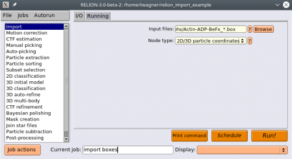
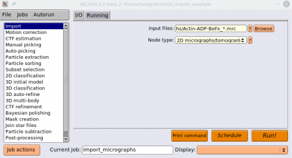
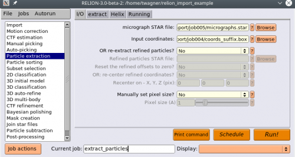

Import crYOLO filament coordinates into Relion
^^^^^^^^^^^^^^^^^^^^^^^^^^^^^^^^^^^^^^^^^^^^^^

After the picking of filaments with crYOLO is done, one might want to import them into Relion. In this example I assume the following:

The folder :file:`micrographs` contains your images. In this example the filenames are Actin-ADP-BeFx_NUMBER.mrc.
The folder :file:`picked_boxes` contains your box files in helicon format.

The following illustrates how you can import the micrographs and box files into Relion:

1. Move the box files from :file:`picked_boxes` into the :file:`micrographs` directory. The box files and the micrographs should be in the same directory before importing them into Relion.

2. Start Relion

3. We will start by importing the box files. Select the :guilabel:`Import` action. Under :guilabel:`Node type`, select :guilabel:`2D/3D particle coordinates`. Under input files, point to your box files in the :file:`micrographs` directory, where everything starting from the running number is replaced by a * (except the suffix (e.g. _autopick.box), if one exists). Press :guilabel:`Run!`

4. Now we import the corresponding MRC files. Select the :guilabel:`Import` action again. Under Node type, enter :guilabel:`2D micrographs/tomogram`. Under input files, point to your mrc files in the :guilabel:`micrographs` directory, where the running number is replaced by a "*". Press :guilabel:`Run!`

5. Now we will extract the particles. Select the :guilabel:`Particle extraction` action. For :guilabel:`micrograph STAR file`, select the :file:`micrographs.star` file, and for Input coordinates select :file:`coords_suffix.box`.

.. warning::
    Use the :file:`micrographs.star` file from your CTF estimation. It provides necessary information for further processing. Alternatively, you can set your :guilabel:`Pixel size` manually in the :guilabel:`I/O` tab of the :guilabel:`Particle extraction` job.

6. Go to the :guilabel:`extract` tab and set your :guilabel:`Particle box size`.

7. Select the :guilabel:`Helix` tab, and set :guilabel:`Extract helical segments?` to :guilabel:`Yes` and :guilabel:`Coordinates are start-end only?` to :guilabel:`No`. Also change your :guilabel:`Tube diameter`. Press :guilabel:`Run!`

Now your particles should be extracted!
