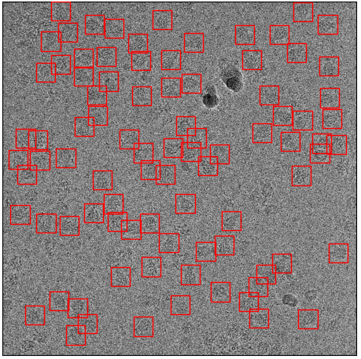

.. _sparse-picking-label:
CrYOLO on sparsely labeled data
^^^^^^^^^^^^^^^^^^^^^^^^^^^^^^^^^^^^^

In the first preprint of crYOLO we wrote the following sentence without any comments:

 Ideally, each micrograph should be picked to completion.

However, you don't have to pick all particles in a micrograph to train crYOLO. Here I want to show
how crYOLO performs with only sparsely labeled micrographs.

Toxin
*****

I took our toxin dataset, which I've used to train crYOLO before. The training set comprises 14 images
with 1586 particles (~113 particles per micrograph). An example is shown here:

    Training image with all particles labeled

I then **removed randomly 80%** of the particles (above) and used it for training (default settings
as in the tutorial). The training set now consists of only 314 particles:

    Sparsely labeled micrograph from the sparse training set

I now use the trained model to pick the whole dataset. The picking with the default threshold is
quite dissatisfying, as it only picks ~65 particles per micrograph:

    First example: Picked particles with default threshold 0.3

    Second example: Picked particles with default threshold 0.3

However, if one uses the cbox files and the box manager, you can :ref:`easily choose a different
confidence threshold<visualize-results-label>`. With a threshold of 0.14 for example, you practically get all of your
particles while at the same time excluding contamination:

    First example: Picked particles with a threshold of 0.14 found by using cbox files.

    Second example: Picked particles with a threshold of 0.14 found by using cbox files.

.. warning::
    The recall reported during training in such cases will be misleading, as it is calculated based on the default threshold of 0.3.

ATP Synthase
************

I did the same with ATP synthase. The orginal training set had 1723 particle from 91 micrographs.
The sparsely labeled training dataset used the same training images but only with 334 particles
labeled from 91 micrographs. Here are examples:

    Original training set

    Sparsely picked training set

Now the comparision between picking with default and picking with an adjusted threshold:

    Picked with default threshold 0.3

    Picked with threshold 0.14

And another example:

    Picked with default threshold 0.3

    Picked with threshold 0.14

Again, it still picks basically everything while avoiding contamination.

TRPC4
*****

The last example that I've choosen is TRPC4, as it contains much more contamination. The original
training set comprises 32 images with 3038 particles (~94 particles / image):

    Example micrograph from the original training set.

Again, the same procedure as with toxin and ATP synthase. I removed 80% of particles randomly:

    Example micrograph from the sparsely labeled training set.

I trained the model, and picked again. Here are the results for picking with the default threshold:

.. figure:: ../img/sparse/trpc_03.png
    :width: 300

    Picking result with default threshold 0.3

It missed a lot, but picked far more that one would expect from the sparsely labeled training data. The missing particles appearing when you reduce the threshold to 0.14:

    Picking result with threshold 0.14

Particles picked, contamination skipped, mission accomplished :-)

