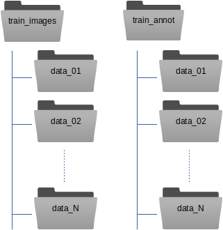

.. _train-gen-model-label:
Train your own general model
^^^^^^^^^^^^^^^^^^^^^^^^^^^^

Training a model for a specific dataset is very easy with crYOLO. However, you might have multiple data collections of the same particle with different settings, a different camera or another microscope. A model trained on the data of one data collection, might not perform very good on a dataset from another data collection.

However, you can easily train a crYOLO model that generalize well on data recorded under multiple conditions. To achieve this, all you have to do is to merge training data of multiple datasets. The result will be a model that can be applied to a new dataset from a new data collection without additional training.

Here is our recommendation how to organize the training data. Instead of copying your images and box files directly into :file:`train_images` / :file:`train_annot`, you can copy them into subfolders. One for each data collection:

The :samp:`train_image_folder` and :samp:`train_annot_folder` parameters in the crYOLO configuration file (e.g. config.json) still point to the root directories train_images and train_annot respectively. The parameter anchors should be set roughly to the average of all particle box sizes. Other than that, the training of a general model does not differ from training a model from scratch.

.. hint::

    When running the training of a general model, we always use the :option:`--warm_restarts`. Moreover, a general model with multiple datasets should train for a longer time. If we train our general model on 63 datasets we use the option :option:`--early 300`.
