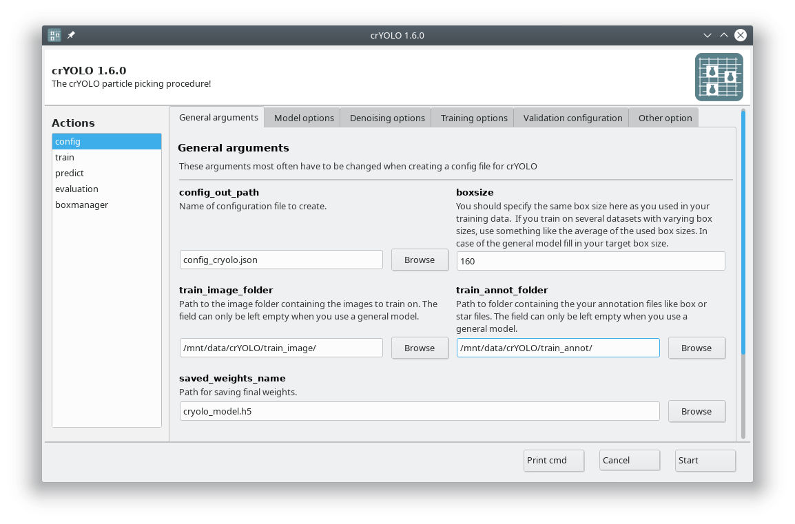

You now have to create a configuration file for your picking project. It contains all important constants and paths and helps you to reproduce your results later on.

You can either use the command line to create the configuration file or the GUI. For most users, the GUI should be easier. Select the config action and fill in the general fields:

At this point you could already press :guilabel:`Start` to generate the config file but you might want to take these options into account:

.. sidebar:: Validation data

    Micrographs that are selected as validation data are not used to train crYOLO. These micrographs are used to calculate how well the model performs and whether it still improves.

* During training, crYOLO also needs validation data. Typically, 20% of the training data are randomly chosen as validation data. If you want to use specific images as validation data, you can move the images and the corresponding box files to separate folders. Make sure that they are removed from the original training folder! You can then specify the new validation folders in “Validation configuration” tab.

* By default, your micrographs are low pass filtered to an absolute frequency of 0.1 and saved to disk. You can change the cutoff threshold and the directory for filtered micrographs in the “Denoising options” tab.

* When training from scratch, crYOLO is initialized with weights learned on the ImageNet training data (transfer learning). However, it might improve the training if you set the pretrained_weights options in the “Training options” tab to the current general model. Please note, doing this you don't fine tune the network, you just change the initial model initialization.

.. _denoise-janni-label:
.. admonition:: Alternative: Using neural-network denoising with JANNI

    You can also use neural network denoising with `JANNI <https://sphire.mpg.de/wiki/doku.php?id=janni>`_.
    The easiest way is to use the JANNI's general model (`Download here <https://sphire.mpg.de/wiki/doku.php?id=janni#janni_general_model>`_)
    but you can also `train JANNI for your data <https://sphire.mpg.de/wiki/doku.php?id=janni_tutorial#training_a_model_for_your_data>`_. crYOLO directly uses an interface to JANNI to filter
    your data, you just have to change the filter argument in the :guilabel:`Denoising` tab from :guilabel:`LOWPASS` to :guilabel:`JANNI` and specify the path to your JANNI model:

    I recommend to use denoising with JANNI only together with a GPU as it is rather slow (~ 1-2 seconds
    per micrograph on the GPU and 10 seconds per micrograph on the CPU)

.. admonition:: Editing the configuration file

    You can also modify all options and parameters directly in the config.json file. It can be opened
    by any text editor. Please note the wiki entry about the :ref:`crYOLO configuration file <config-file-label>` if you want to
    know more details.

.. hint::

    **Alternative: Create the configuration file with the command line**

    To create a basic configuration file that will work for most projects is very simple. I assume
    your box files for training are in the folder :file:`train_annot` and the corresponding images in
    :file:`train_image`. I furthermore assume that your box size in your box files is 160. To create the config
    :file:`config_cryolo.json` simply run:

    >>> cryolo_gui.py config config_cryolo.json 160 --train_image_folder train_image --train_annot_folder train_annot

    To get a full description of all available options type:

    >>> cryolo_gui.py config -h

    If you want to specify separate validation folders you can use the :option:`--valid_image_folder` and :option:`--valid_annot_folder` options:

    >>> cryolo_gui.py config config_cryolo.json 160 --train_image_folder train_image --train_annot_folder train_annot --valid_image_folder valid_img --valid_annot_folder valid_annot

