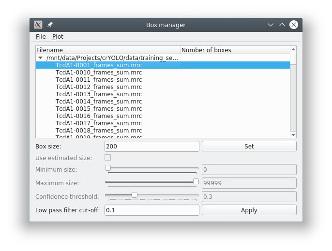

In the following I will assume that your image data is in the folder full_data.

The next step is to create training data. To do so, we have to pick single particles manually
in several micrographs. Ideally, the micrographs are picked to completion. :ref:`However, it is not
necessary to pick all particles. crYOLO will still converge if you miss some (or even many)<sparse-picking-label>`.

.. admonition:: How many micrographs have to be picked?

    It depends! Typically 10 micrographs are a good start. However, that number may increase / decrease
    due to several factors:

        * A very heterogenous background could make it necessary to pick more micrographs.
        * When you refine a general model, you might need to pick fewer micrographs.
        * If your micrograph is only sparsely decorated, you may need to pick more micrographs.

    We recommend that you start with 10 micrographs, then autopick your data, check the results and
    finally decide whether to add more micrographs to your training set. If you refine a general
    model, even 5 micrographs might be enough.

To create your training data, crYOLO is shipped with a tool called “boxmanager”. However, you can
also use tools like e2boxer to create your training data.

Start the box manager with the following command:

>>> cryolo_boxmanager.py

Now press :menuselection:`File --> Open image folder` and the select the :file:`full_data` directory. The first image should
pop up. You can navigate in the directory tree through the images. Here is how to pick particles:

* :kbd:`LMB`: Place a box
* Hold :kbd:`LMB`: Move a box
* :kbd:`Control` + :kbd:`LMB`: Remove a box
* :kbd:`h` KEY: Toggle to make boxes invisible / visible

You might want to run a low pass filter before you start picking the particles. Just press :guilabel:`Apply`
to get a low pass filtered version of your currently selected micrograph. An absolute
frequency cut-off of 0.1. The allowed values are 0 - 0.5. Lower values means stronger filtering.

You can change the box size in the main window, by changing the number in the text field :guilabel:`Box size`:
Press :guilabel:`Set` to apply it to all picked particles. For picking, you should the use minimum
sized square which encloses your particle.

If you finished picking from your micrographs, you can export your box files with :menuselection:`Files --> Write box
files`. Create a new directory called train_annotation and save it there. Close boxmanager.

Now create a third folder with the name :file:`train_image`. Now for each box file, copy the corresponding
image from :file:`full_data` into :file:`train_image`.

.. note::

    While it is nice to keep your files organized, you don't have to copy your training images into a separate folder. In the configuration file (see below) you can also simply specify the full_data directory as “train_image_folder”. CrYOLO will find the correct images using the box files.

crYOLO will detect image / box file pairs by taking the box file and searching for an image filename which contains the box filename.
