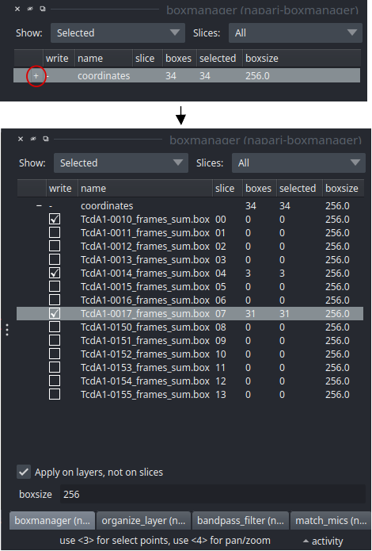

.. include:: text_modules/data_prep_filament_startbm.rst

Now press :guilabel:`File` -> :guilabel:`Open Folder` and the select the :file:`images` directory.

.. include:: text_modules/data_prep_filter.rst

.. include:: text_modules/data_prep_pick_particles.rst

Save your annotations to disk
""""""""""""""""""""""""""""

If you finished picking from your micrographs, you can export your box files in tab :guilabel:`organize_layer`. The defaults should be fine so you can directly press :guilabel:`Save to dir`. Training data is created for all micrographs that have an activated checkbox.  Create a new directory called train_annotation and save it there. Close boxmanager.

Optionally, you now create a third folder with the name :file:`train_image`. Now for each box file, copy the corresponding
image from :file:`images` into :file:`train_image`.

.. note::

    While it is nice to keep your files organized, you don't have to copy your training images into a separate folder. In the configuration file (see below) you can also simply specify the :file:`images` directory as :guilabel:`train_image_folder`. CrYOLO will find the correct images using the box files.

crYOLO will detect image / box file pairs by taking the box file and searching for an image filename which contains the box filename.
