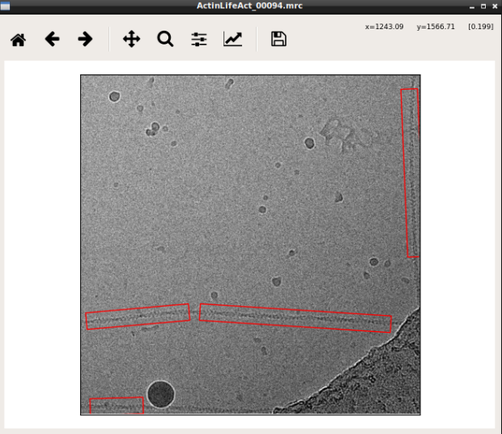

In the following I will assume that your image data is in the folder :file:`images`.

The next step is to create training data. To do so, we have to pick single filaments manually in several micrographs. Ideally, the micrographs are picked to completion. :ref:`However, it is not necessary to pick all particles. crYOLO will still converge if you miss some (or even many)<sparse-picking-label>`.

.. admonition:: How many micrographs have to be picked?

    It depends! Typically 10 micrographs are a good start. However, that number may increase / decrease
    due to several factors:

        * A very heterogeneous background could make it necessary to pick more micrographs.
        * When you refine a general model, you might need to pick fewer micrographs.
        * If your micrograph is only sparsely decorated, you may need to pick more micrographs.

    We recommend that you start with 10 micrographs, then autopick your data, check the results and
    finally decide whether to add more micrographs to your training set. If you refine a general
    model, even 5 micrographs might be enough.

To create your training data, crYOLO is shipped with a tool called “boxmanager”.

Start the box manager with the following command:

>>> cryolo_boxmanager.py

Now press :guilabel:`File` -> :guilabel:`Open` -> :guilabel:`SPA` -> :guilabel:`Micrograph folder` and the select the :file:`images` directory. The first image should
pop up. You can navigate in the directory tree through the images.

You might want to run a low pass filter before you start picking. Switch to tab :guilabel:`Filtering` and press :guilabel:`Apply`
to get a low pass filtered version of your currently selected micrograph. An absolute
frequency cut-off of 0.1. The allowed values are 0 - 0.5. Lower values means stronger filtering.

Here is how to pick filaments:

* Place a filament box: Click with :kbd:`LMB` + Hold at the start of the filament. Then drag the mouse to the position where the filament box should end and release the :kbd:`LMB`.
* Remove filament box: Hold :kbd:`Control` pressed and click with the :kbd:`LMB` inside the box you want to remove.

You can change the box width in the main window, by changing the number in the text field :guilabel:`Box size`:
Press :guilabel:`Set` to apply it to all picked filaments. For training crYOLO, you should the use a box width ~ 2x bigger than
your filament width.

If you have micrographs that do not contain particles but only contamination / ice you can add them to your training set by activate the checkbox in front of the micrograph.

If you finished picking, you can export your box files with :guilabel:`File` -> :guilabel:`Save`. Training data is created for all micrographs that have an activated checkbox. Create a new directory called :file:`boxes` and save it there. The boxmanager will now ask you for a :guilabel:`box distance`. It set to 10 percent of your box size and you can keep the default. Then close boxmanager.

In the folder :file:`boxes` you just created, you will find three subdirectories:

* :file:`CBOX_FILAMENT`: Contains filament coordinates segmented (according :guilabel:`box distance`) into several boxes in the cbox format
* :file:`EMAN_HELICON`: Contains filament coordinates segmented into several boxes in eman helicon format.
* :file:`EMAN_START_END`: Contains filament coordinates specified by start and end coordinates in EMAN format.
* :file:`STAR_START_END`: Contains filament coordinates specified by start and end coordinates in STAR (Relion) format.

In principle you can use any format for training, in this tutorial we will use :file:`CBOX_FILAMENT`. Create a new folder called :file:`train_annotation` and copy the files from :file:`CBOX_FILAMENT` into this folder. Alternatively you can also directly
specify the :file:`CBOX_FILAMENT` folder during the configuration step.
