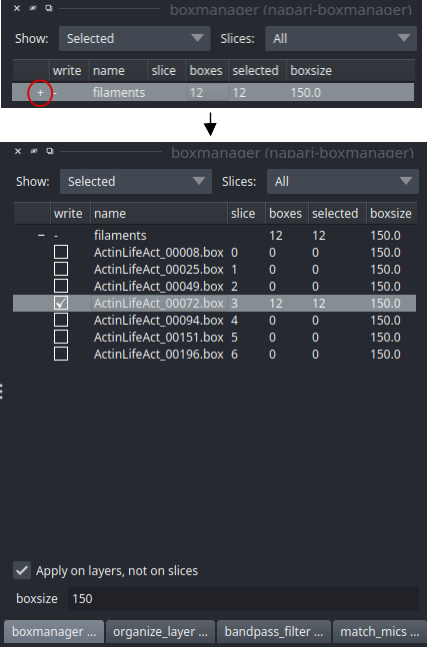

.. include:: text_modules/data_prep_filament_startbm.rst

Now press :guilabel:`File` -> :guilabel:`Open Folder...` and the select the :file:`images` directory.

.. include:: text_modules/data_prep_filter.rst

.. include:: text_modules/data_prep_filter_pick_filament.rst

.. include:: text_modules/data_prep_filament_save.rst

