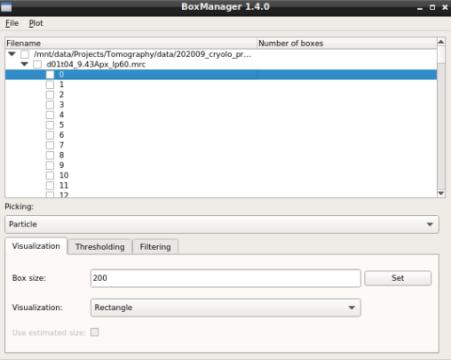
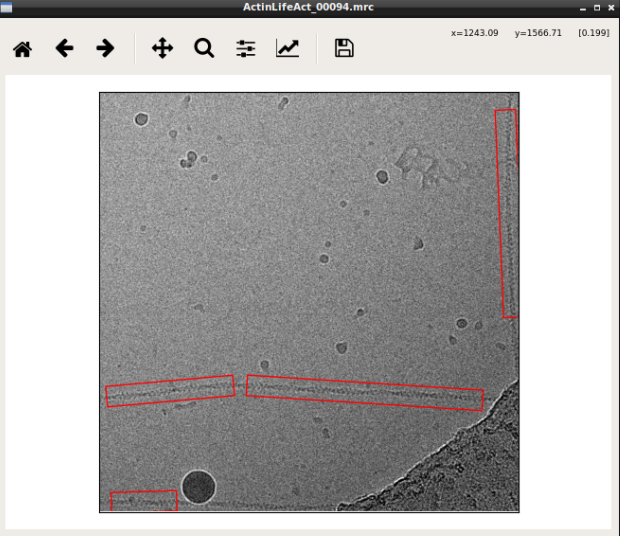

.. include:: text_modules/data_prep_filament_startbm_tomo.rst

For opening your tomograms you have two options:

    * **Single tomogram**: Press :guilabel:`File` -> :guilabel:`Open` -> :guilabel:`Tomogram` -> :guilabel:`File` and the select one file from the :file:`images` directory. The first slice of the tomogram should pop up. You can navigate in the directory tree through the slices.
    * **Folder**: Press :guilabel:`File` -> :guilabel:`Open` -> :guilabel:`Tomogram` -> :guilabel:`Folder` and the select the :file:`images` directory. The first slice of the first tomogram will pop up. You can find all tomograms organized in subtrees.

.. include:: text_modules/data_prep_filter.rst

.. include:: text_modules/data_prep_filter_pick_filament.rst

Label your filaments in some slices ideally on multiple tomograms. Label them even if the slices do not show
the centre of the filaments but only parts of it.

.. include:: text_modules/data_prep_filamant_save.rst

In the folder :file:`boxes` you just created, you will find three subdirectories :file:`CBOX_FILAMENT`. One file for each tomogram. Each file contains filament coordinates segmented (according :guilabel:`box distance`) into several boxes.

Create a new folder called :file:`train_annot` and copy the files from :file:`CBOX_FILAMENT` into this folder. Alternatively you can also directly specify the :file:`CBOX_FILAMENT` folder during the configuration step.

