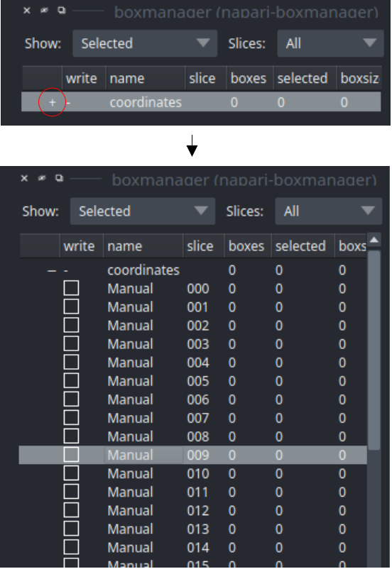

.. include:: text_modules/data_prep_filament_startbm.rst

For opening your tomograms you have to options:

    * **Single tomogram**: Press :guilabel:`File` -> :guilabel:`Open File(s)...` and the select one file from the :file:`images` directory.
    * **Folder**: Press :guilabel:`File` -> :guilabel:`Open Folder...` and the select the :file:`images` directory.

.. include:: text_modules/data_prep_filter.rst

.. include:: text_modules/data_prep_pick_particles.rst

Deactivate :guilabel:`out of slice` in layer controls (top left).

.. note::

    ** Label also not centered particles **

    crYOLO is trained on slices. The z-coordinate is only used to identify the relevant slices. To make this clear, its better to deactivate :guilabel:`out of slice` in layer controls. Otherwise, slices can look completely picked while they are actually not. Label the particles even if the slices do not show the centre of the particle but only a slice of it.

Label your particles in some slices ideally on multiple tomograms. Its important to label them even if the slices do not show the centre of the particle but only slice of it.

If you finished picking from your tomogram, you can export your coordinate files in tab :guilabel:`organize_layer`. Set the :guilabel:`Format` to :guilabel:`.cbox` and press :guilabel:`Save to dir`. Create a new directory called :file:`train_annot` and save it there. Close boxmanager.

