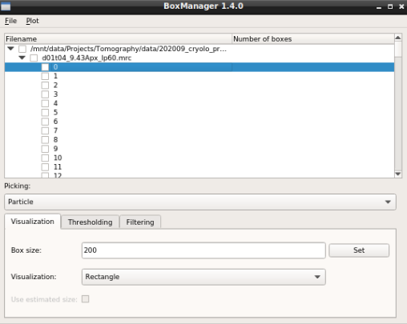

.. include:: text_modules/data_prep_filament_startbm.rst

For opening your tomograms you have to options:

    * **Single tomogram**: Press :guilabel:`File` -> :guilabel:`Open File(s)...` and the select one file from the :file:`images` directory.
    * **Folder**: Press :guilabel:`File` -> :guilabel:`Open Folder...` and the select the :file:`images` directory.

.. include:: text_modules/data_prep_filter.rst

.. include:: text_modules/data_prep_pick_particles.rst

Label your particles in some slices ideally on multiple tomograms. Label them even if the slices do not show the centre of the particle but only slice of it.

If you finished picking from your micrographs, you can export your coordinate files in tab :guilabel:`organize_layer`. Set the :guilabel:`Format` to :guilabel:`.cbox` and press :guilabel:`Save to dir`. Training data is created for all slices that have an activated checkbox.  Create a new directory called :file:`train_annot` and save it there. Close boxmanager.

