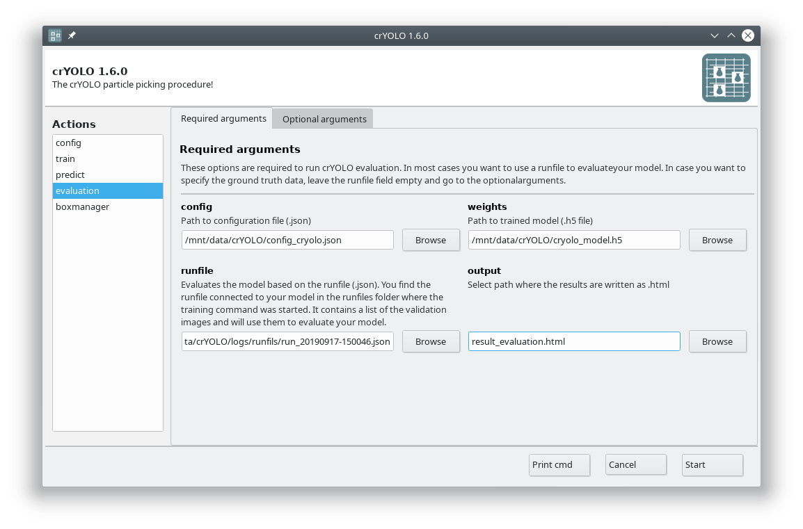
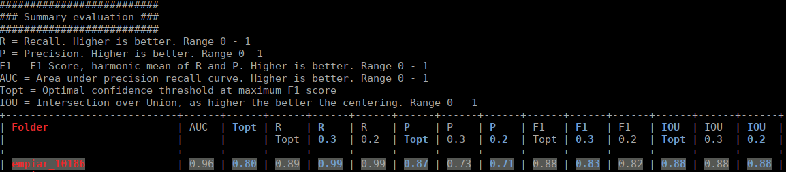

The evaluation tool allows you, based on your validation micrographs, to get statistics about the success of your training.

To understand the outcome, you have to know what precision and recall is. Here is good figure from wikipedia:

.. image:: https://sphire.mpg.de/wiki/lib/exe/fetch.php?cache=&media=pipeline:window:cryolo:precision_recall.png
    :width: 600

Another important measure is the F\ :sub:`1` (:math:`\beta = 1`) and F\ :sub:`2` (:math:`\beta = 2`) score:

.. math::

   F_\beta = (1+\beta)^2 \cdot \frac{precision \cdot recall}{\beta^2 \cdot precision + recall}

.. warning::

    **Precision metric can be misleading**

    If your validation micrographs are not labeled to completion the precision value will be misleading.
    crYOLO will start picking the remaining 'unlabeled' particles, but for statistics they are counted
    as false-positive (as the software takes your labeled data as ground truth).

If you followed the tutorial, the validation data are selected randomly. A run file for each training
is created and saved into the folder :file:`logs/runfiles` in your project directory. These runfiles
are .json files containing information about what micrographs were selected for validation.
To calculate evaluation metrics select the evaluation action.

Fill out the fields in the :guilabel:`Required arguments` tab:

Press :guilabel:`Start` to calculate the evaluation results.

.. hint::

    **Alternative: Run evaluation from the command line**

    .. prompt:: bash $

        cryolo_evaluation.py -c config.json -w model.h5 -r runfiles/run_YearMonthDay-HourMinuteSecond.json -g 0

The html file you specified as output looks like this:

The table contains several statistics:

* **AUC**: Area under curve of the precision-recall curve. Overall summary statistics. Perfect classifier = 1, Worst classifier = 0
* **Topt**: Optimal confidence threshold with respect to the F1 score. It might not be ideal for your picking, as the F1 score weighs recall and precision equally. In single particle analysis, recall is often more important than the precision.
* **R (Topt)**: Recall using the optimal confidence threshold.
* **R (0.3)**: Recall using a confidence threshold of 0.3.
* **R (0.2)**: Recall using a confidence threshold of 0.2.
* **P (Topt)**: Precision using the optimal confidence threshold.
* **P (0.3)**: Precision using a confidence threshold of 0.3.
* **P (0.2)**: Precision using a confidence threshold of 0.2.
* **F1 (Topt)**: Harmonic mean of precision and recall using the optimal confidence threshold.
* **F1 (0.3)**: Harmonic mean of precision and recall using a confidence threshold of 0.3.
* **F1 (0.2)**: Harmonic mean of precision and recall using a confidence threshold of 0.2.
* **IOU (Topt)**: Intersection over union of the auto-picked particles and the corresponding ground-truth boxes. The higher, the better – evaluated with the optimal confidence threshold.
* **IOU (0.3)**: Intersection over union of the auto-picked particles and the corresponding ground-truth boxes. The higher, the better – evaluated with a confidence threshold of 0.3.
* **IOU (0.2)**: Intersection over union of the auto-picked particles and the corresponding ground-truth boxes. The higher, the better – evaluated with a confidence threshold of 0.2.

If the training data consist of multiple folders, then evaluation will be done for each folder
separately. Furthermore, crYOLO estimates the optimal picking threshold regarding the F\ :sub:`1` Score
and F\ :sub:`2` Score. Both are basically average values of the recall and prediction, whereas
the F\ :sub:`2` score puts more weights on the recall, which is in cryo-EM often more important.