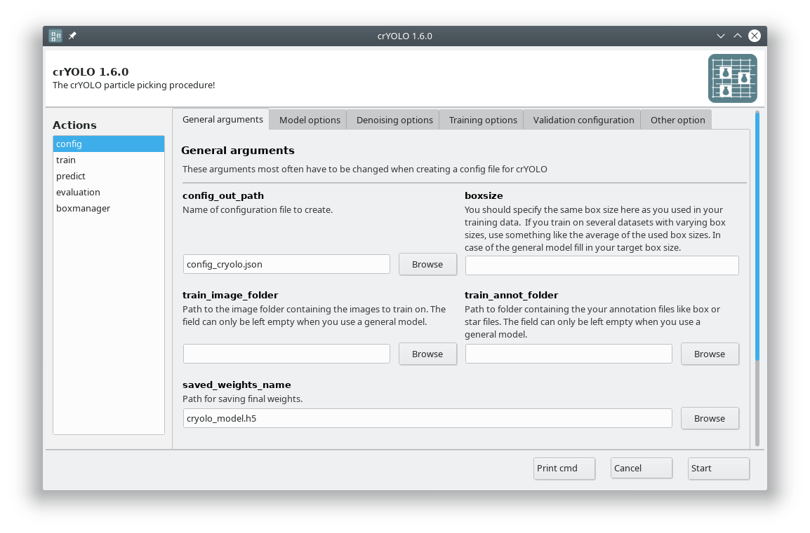
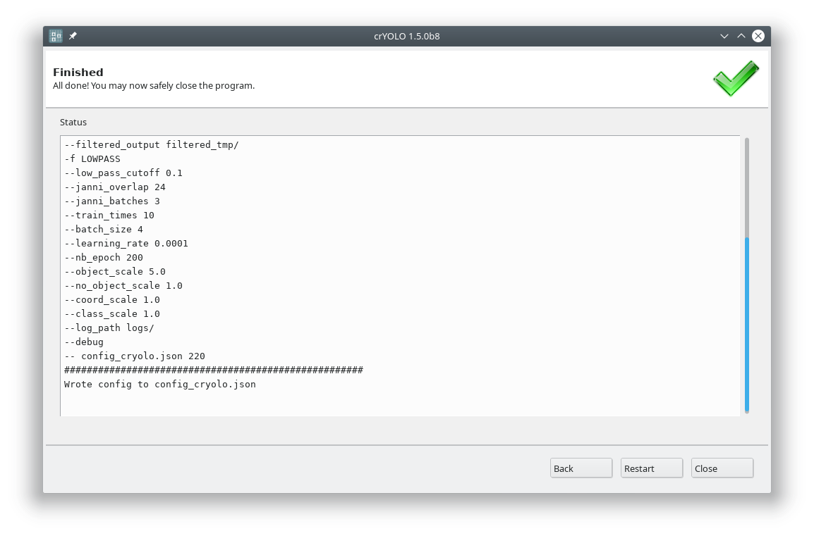

You can use crYOLO either by command line or by using the GUI. The GUI should be easier for
most users. You can start it with:

>>> cryolo_gui.py

The crYOLO GUI is essentially a visualization of the command line interface.
On left side, you find all possible “Actions”:

* :guilabel:`config`: With this action you create the configuration file that you need to run crYOLO.
* :guilabel:`train`: This action lets you train crYOLO from scratch or refine an existing model.
* :guilabel:`predict`: If you have a (pre)trained model you can pick particles in your data set using this command.
* :guilabel:`evaluation`: This action helps you to quantify the quality of your model.
* :guilabel:`boxmanager`: This action starts the cryolo boxmanager. You can visulize the picked particles with it or create training data.

Each action has several parameters which are organized in tabs. Once you have chosen your settings
you can press :guilabel:`Start` (just as example, don't press it now ;-)), the command will be applied and
crYOLO shows you the output:

It will tell you if something went wrong. Moreover, it will tell you all parameters used.
Pressing :guilabel:`Back` brings you back to your settings, where you can either edit the settings (in case
something went wrong) or go to the next action.