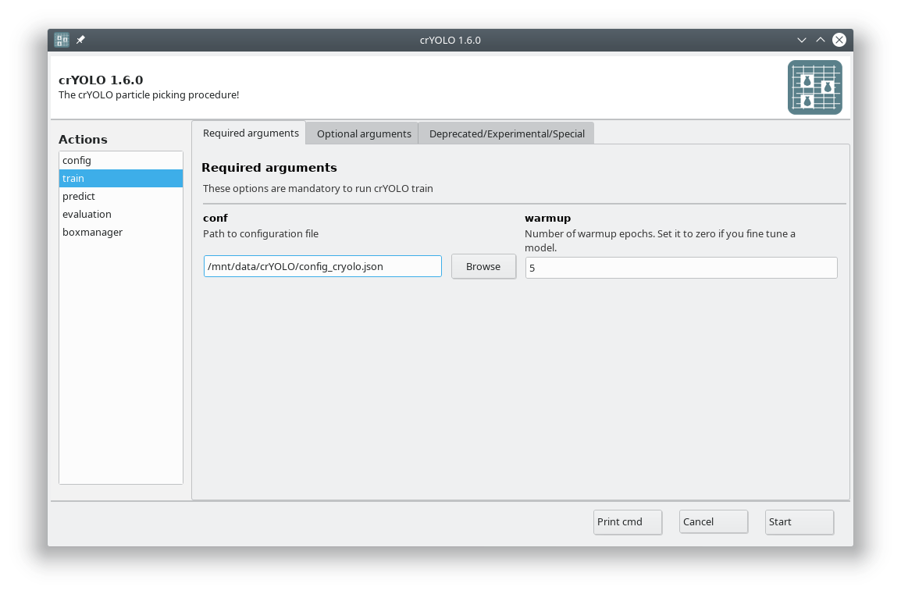

Now you are ready to train the model. In case you have multiple GPUs, you should first select a free
GPU. The following command will show the status of all GPUs:

>>> nvidia-smi

For this tutorial, we assume that you have either a single GPU or want to use GPU 0.

.. admonition:: Use a different or multiple GPUs

    In the :guilabel:`Optional arguments` tab you can change the GPU that should be used by crYOLO.
    If you have multiple GPUs (e.g. nvidia-smi lists GPU 0 and GPU 1) you can also use both by
    setting the GPU argument to '0 1'.

In the GUI you have to fill in the mandatory fields:

The default number of :guilabel:`warmup` :abbr:`epochs (One epoch is a complete pass through the training data.)` is fine as long as you don't want to refine an existing model.
During the warmup training epochs it will not try to estimate the size of your particle, which helps
crYOLO to converge.

.. admonition:: When does crYOLO stop the training?

    When you start the training, it will stop when the “loss” metric on the validation data does not
    improve 10 times in a row. This is typically enough. In case you want to give the training more
    time to find the best model you can increase the “not changed in a row” parameter to a higher value by
    setting the early argument in the :guilabel:`Optional arguments` to, for example, 15.

The final model will be written to disk as specified in saved_weights_name in your configuration file.

Now press the :guilabel:`Start` button to start the training.

.. hint::

    **Alternative: Train crYOLO using the command line**

    Navigate to the folder with :file:`config_cryolo.json` file, :file:`train_image` folder etc.

    >>> cryolo_train.py -c config_cryolo.json -w 5 -g 0

    The final model file will be written to disk.

