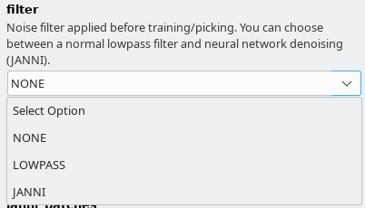

Tutorial 1: Pick particles without training using a general model
==========================================================

Here you can find how to apply the general models we trained for you.
If you would like to train your own general model, please see our
extra wiki page: :ref:`How to train your own general model <train-gen-model-label>`.

Our general models can be found and downloaded here: :ref:`Download and Installation <general-model-label>`.

If you followed the installation instructions, you now have to activate the cryolo virtual environment with

>>> source activate cryolo

1. Start crYOLO
^^^^^^^^^^^^^^^
.. include:: start_cryolo.rst

2. Configuration
^^^^^^^^^^^^^^^^
In the GUI choose the config action. Fill in your target box size and leave the :guilabel:`train_image_folder`
and :guilabel:`train_annot_folder` fields empty.

:ref:`There are three general models available <general-model-label>`. It is important that you
choose the same filtering options in :guilabel:`Denoising options` tab as we did during training the
general models. In the following are the filtering settings that we used for the respective
general models:

* General model trained for low-pass filtered images : As :guilabel:`filter` select :guilabel:`LOWPASS` and :guilabel:`low_pass_cutoff` of 0.1

* General model trained for JANNI-denoised images: As :guilabel:`filter` select :guilabel:`JANNI` and the `janni general model <https://sphire.mpg.de/wiki/doku.php?id=janni#janni_general_model>`_ for :guilabel:`janni_model`. Keep the defaults for janni_overlap and janni_batches

* General model for negative stain images: As :guilabel:`filter` select :guilabel:`NONE`

.. admonition:: Anchor size is optional

    In the configuration file, the field “anchors” is optional during prediction. That means, you
    don't to define a box size during prediction, as crYOLO does a size estimation internally.
    This is of advantage for automated pipelines. You can simply delete the entry in configuration
    file. This should not affect the picking quality. The estimated size is still contained in
    .cbox files. Coordinates in EMAN and STAR format are written with a box size of 0 in that case.

Press :guilabel:`Start` to write the configuration file to disk.

.. hint::

    **Alternative: Create the configuration file using the command line**

    In the following I assume that you target box size is 220. Please adapt if necessary.
    For the general Phosaurus network trained for low-pass filtered cryo images run:

    >>> cryolo_gui.py config config_cryolo.json 220 --filter LOWPASS --low_pass_cutoff 0.1

    For the general model trained with neural-network denoised cryo images (with JANNI's general model) run:

    >>> cryolo_gui.py config config_cryolo.json 220 --filter JANNI --janni_model /path/to/janni_general_model.h5

    For the general model for negative stain data please run:

    >>> cryolo_gui.py config config_cryolo.json 220 --filter NONE

3. Picking
^^^^^^^^^^
.. include:: picking.rst

4. Visualize the results
^^^^^^^^^^^^^^^^^^^^^^^^
.. include:: visualize_results.rst

