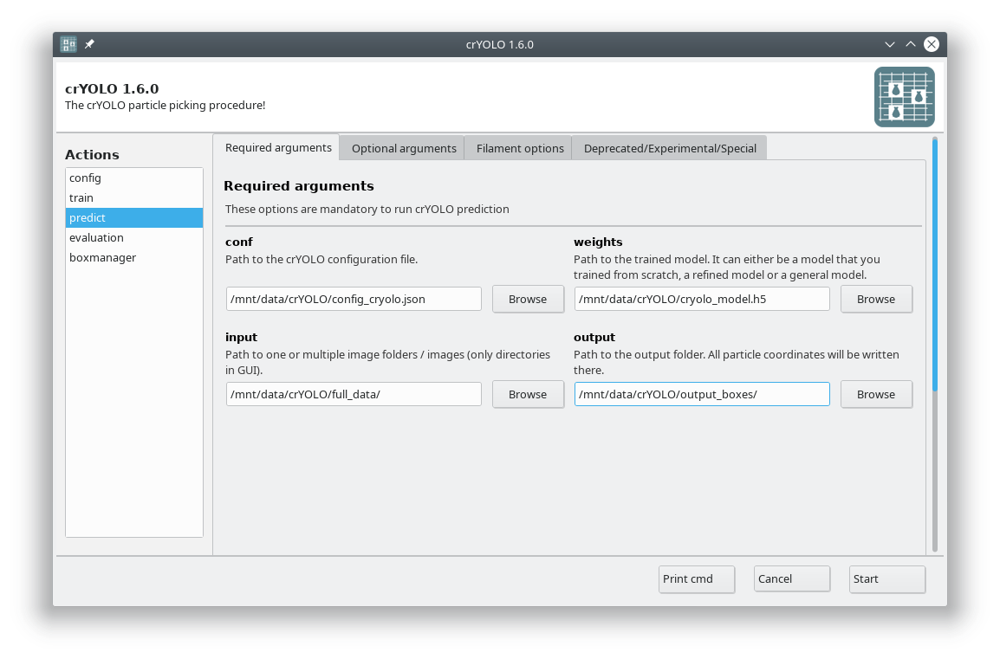
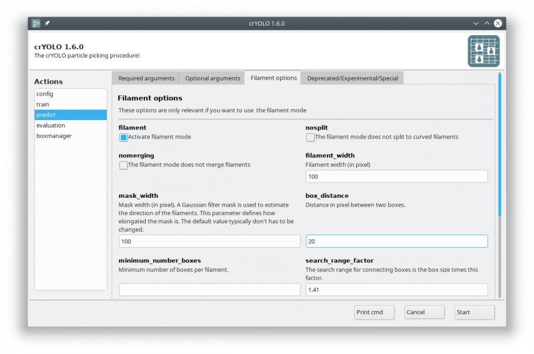

Tutorial 3: Pick filaments using a model trained for your data
==============================================================
When picking filaments, it is important to identify each filament individually. This allows specific
spacing of the boxes (i.e., the helical rise) to maximize the number of particles. CrYOLO supports
this method of picking filaments.

Filament mode on actin:

.. list-table::

    * - .. figure:: ../img/action_tracing_2.png

      - .. figure:: ../img/actin_tracing_1.png

Filament mode on MAVS (EMPIAR-10031) :

.. list-table::

    * - .. figure:: ../img/filament_tracing_02.png

      - .. figure:: ../img/filament_tracing_03.png

1. Data preparation
^^^^^^^^^^^^^^^^^^^
The first step is to create the training data for your model. Right now, you have to use the
:command:`e2helixboxer.py` for this:

>>> e2helixboxer.py --gui train_image/*.mrc

After tracing your training data in e2helixboxer, export them using :menuselection:`File --> Save`.
Unfortunately you have to do that with each image separately.

.. warning::

    **Adapt the file saving options**

    Make sure that you uncheck the boxes :guilabel:`Write Helices` and :guilabel:`Particle Images`
    and check the box :guilabel:`Particle Coordinates`, as this the only format supported right now (see screenshot). Also remove
    the “_helix_ptcl_coords” suffix in the :guilabel:`Path` field. The coordinate files have to have the same name
    as the micrographs.

In the following example, it is expected that you exported into a folder called :file:`train_annot`.

For projects with roughly 20 filaments per image we successfully trained on 40 images (⇒ 800 filaments).

1. Data preparation (new)
^^^^^^^^^^^^^^^^^^^^^^^^^
.. include:: data_preparation_filament.rst

2. Start crYOLO
^^^^^^^^^^^^^^^
.. include:: start_cryolo.rst

3. Configuration
^^^^^^^^^^^^^^^^
.. include:: configuration.rst

4. Training
^^^^^^^^^^^
.. include:: training.rst

5. Picking
^^^^^^^^^^
Select the action :guilabel:`predict` and fill all arguments in the :guilabel:`Required arguments` tab:

Now select the :guilabel:`Filament options` tab and check :guilabel:`Activate filament mode`,
specifiy the :guilabel:`filament_width` (e.g. 100) and define the :guilabel:`box_distance` (e.g. 20 for 90% overlap when
using a box size if 200):

The directory :file:`output_boxes` will be created and all results are saved there. The traced
filaments will be saved in the eman2 helix format with particle coordinates. But also EMAN2 and STAR start/end coordinates.

.. admonition:: Import into Relion

    You can find a detailed description :ref:`how to import crYOLO filament coordinates into Relion <import-filaments-label>` here.

Press the :guilabel:`Start` button to start the picking.

.. hint::

    **Alternative: Run prediction in command line**

    Let's assume you want to pick a filament with a width of 100 pixels (-fw 100). The box size
    is 200×200 and you want a 90% overlap (-bd 20). Moreover, you wish that each filament has at
    least 6 boxes (-mn 6). The micrographs are in the :file:`full_data` directory. Than the picking
    command would be:

    >>> cryolo_predict.py -c config_cryolo.json -w cryolo_model.h5 -i full_data --filament -fw 100 -bd 20 -o boxes/ -g 0 -mn 6

6. Visualize the results
^^^^^^^^^^^^^^^^^^^^^^^^
.. include:: visualize_results.rst