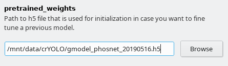
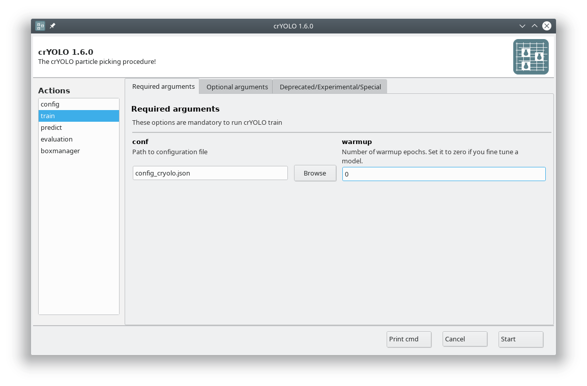

Tutorial 4: Pick particles using the general model refined for your data
========================================================================

With crYOLO you can train a model for your data by fine-tuning the general model.

What does fine-tuning mean?

The general model was trained on a lot of particles with a variety of shapes and therefore learned a robust set of generic features. The last layers, however, learn a fairly abstract representation of the particles and it might be that they do not perfectly fit your particle at hand. In order to adapt this abstract representation within the network to your specific particle, fine-tuning only affects the last convolutional layers, but keeps all others fixed.

Why should I fine-tune my model instead of training from scratch?

1. From theory, using fine-tuning should reduce the risk of overfitting and the amount of the required training data.
2. The training is much faster, as not all layers have to be trained.
3. The training will need less GPU memory and therefore is usable with NVIDIA cards with less memory.

.. admonition:: Overfitting

        Overfitting means, that the model works good on the training micrographs, but not on new unseen micrographs. The model just memorized what it saw instead of learning generic features.

.. warning::

    The fine tune mode is still somewhat experimental and we will update this section as crYOLO develops over time.

If you followed the installation instructions, you now have to activate the cryolo virtual
environment with

>>> source activate cryolo

1. Data preparation
^^^^^^^^^^^^^^^^^^^
.. include:: data_preparation.rst

2. Start crYOLO
^^^^^^^^^^^^^^^
.. include:: start_cryolo.rst

3. Configuration
^^^^^^^^^^^^^^^^
.. include:: configuration.rst

Furthermore, you have to select the model you want to refine. Download the the general model you
want to refine specify in the field :guilabel:`pretrained_weights` in the :guilabel:`Training options` tab.

4. Training
^^^^^^^^^^^
Now you are ready to train the model. In case you have multiple GPUs, you should first select a free
GPU. The following command will show the status of all GPUs:

>>> nvidia-smi

For this tutorial, we assume that you have either a single GPU or want to use GPU 0.

In the GUI choose the action train. In the :guilabel:`Required arguments` tab select the configuration
file we created in the previous step and set the number of warmup periods to zero.

In the :guilabel:`Optional arguments` tab please check the :guilabel:`fine_tune` box.

.. warning::

    **Adjust the number of layers to train**

    The number of layers to fine tune (specified by :guilabel:`layers_fine_tune` in the :guilabel:`Optional arguments`
    tab) is still experimental. The default value of 2 worked for us but you might need more layers.

.. admonition:: Training on CPU

    The fine tune mode is especially useful if you want to train crYOLO on the CPU. On my local
    machine it reduced the time for training crYOLO on 14 micrographs from 12-15 hours to 4-5 hours.

You can now press the :guilabel:`Start` button to start training.

5. Picking
^^^^^^^^^^
.. include:: picking.rst

6. Visualize the results
^^^^^^^^^^^^^^^^^^^^^^^^
.. include:: visualize_results.rst

7. Evaluate your results
^^^^^^^^^^^^^^^^^^^^^^^^
.. include:: evaluate_results.rst
