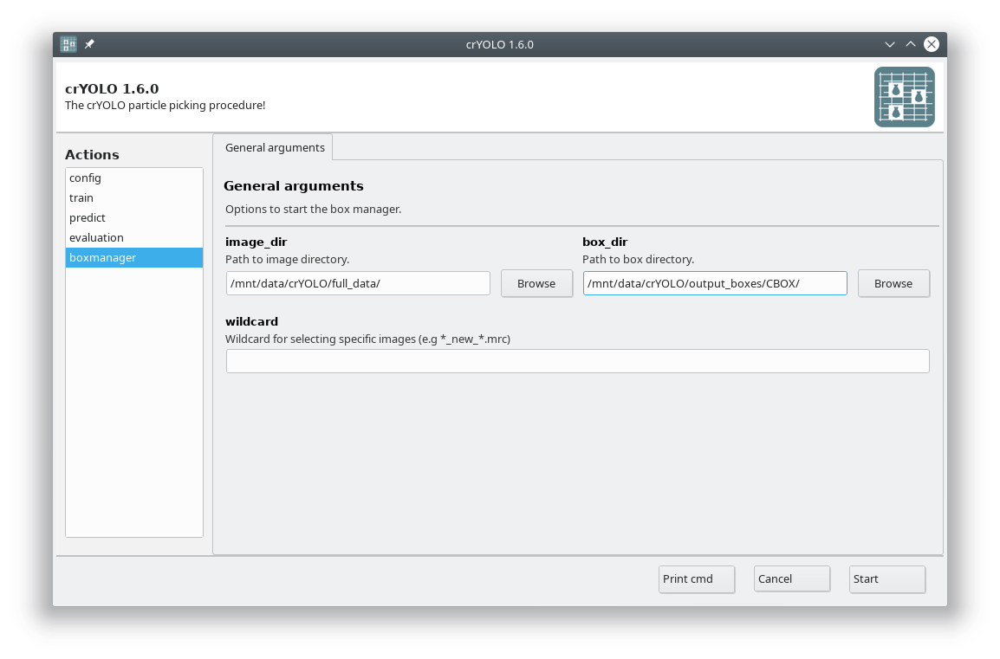
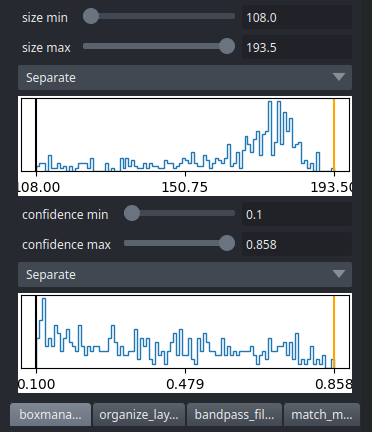

To visualize your results you can use the boxmanager:

As image_dir you select the full_data directory. As :guilabel:`box_dir` you select the :file:`CBOX` folder (or :file:`CBOX_FILAMENT_SEGMENTED` in case of filaments).

CBOX files contain besides the particle coordinates more information like the confidence and the estimated size of each particle. When importing .cbox files into the box manager, it enables more filtering options in the GUI. You can plot size- and confidence distributions.
Moreover, you can change the confidence threshold, minimum and maximum size and see the results in a live preview. If you are done with the filtering, you can then write the new box selection into new box files.
The video below shows an example.

